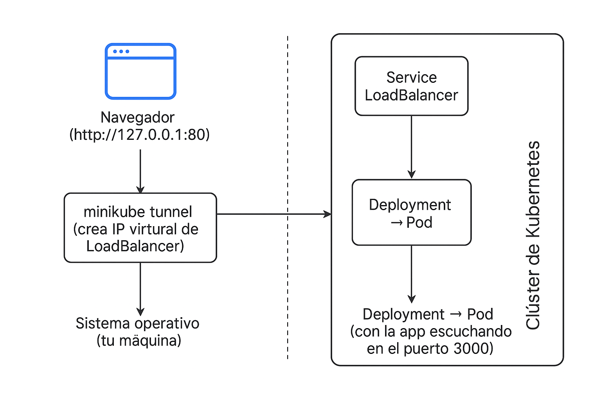
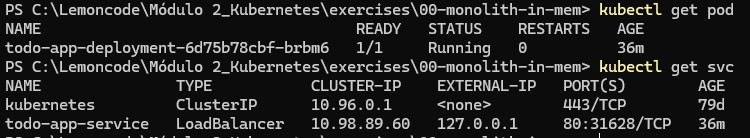
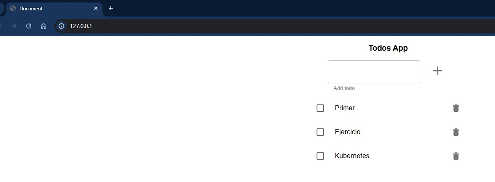

# Ejercicio N°1 - Despliegue de `todo-app` en Kubernetes con Minikube

## Objetivo

Desplegar una aplicación Node.js (`todo-app`) en un clúster de Kubernetes local con Minikube, utilizando un `Deployment` y un `Service` tipo `LoadBalancer`. Acceder a la app desde el navegador mediante `http://127.0.0.1`.



## Paso 1 Crear el Deployment y el Service tipo LoadBalancer

Ver objetos creados.

## Paso 2 Aplicar los objetos generados Deployment y el Service tipo LoadBalancer

```bash
kubectl apply -f todo-app-deployment.yaml
kubectl apply -f todo-app-service.yaml
```

## Paso 3 Levantar el túnel de Minikube

Levantar el túnel minikube en una terminal separada

```bash
minikube tunnel
```

## Paso 4 Verificamos Despligue

```bash
kubectl get pods
kubectl get svc
```



## Paso 5 Verificación desde el navegador

<http://127.0.0.1:80>

