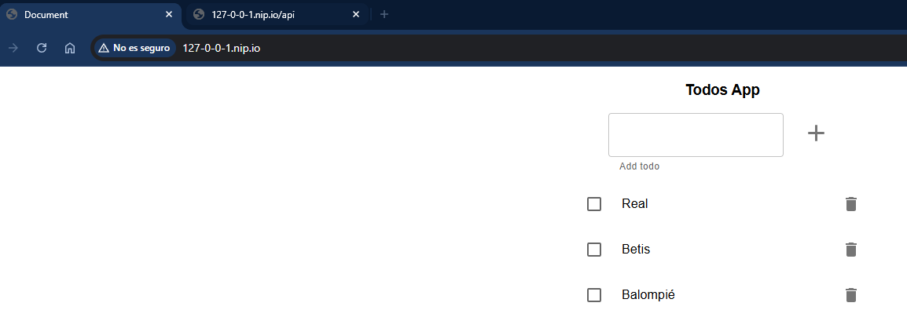

# Despliegue de `todo-front` y `todo-api` con Kubernetes e Ingress

Este ejercicio consiste en desplegar dos aplicaciones (`todo-front` y `todo-api`) dentro de un clúster de Kubernetes, utilizando servicios de tipo `ClusterIP` y un único punto de entrada mediante un `Ingress`.

## Estructura del ejercicio

- `todo-front`: aplicación frontend Node.js que escucha en el puerto 80.
- `todo-api`: API Node.js que escucha en el puerto 3000 y requiere variables de entorno.
- `Ingress`: acceso único a ambos servicios bajo dominios de `nip.io`.

## Pasos para ejecutar el ejercicio

### 1. Configurar Docker para usar el entorno de Minikube

En PowerShell:

```powershell
& minikube -p minikube docker-env | Invoke-Expression
```

### 2. Construir las imágenes localmente

Accediendo a los directorios todo-front y todo-api para construir la imagen a partir de los Dockerfile dados.

```bash
docker build -t todo-front:latest .
docker build -t todo-api:latest .
```

### 3. Cargar las imágenes en Minikube

He cargado las imágenes en Minikube ya que se me ha presentado un problema de que Minikube no encontraba las imagenes y al verificar el estado de los pods se encontraban en estado ImagePullBackOff

```bash
minikube image load todo-front:latest
minikube image load todo-api:latest
```

### 4. Aplicar los objetos de Kubernetes

```bash
kubectl apply -f todo-api-configmap.yaml
kubectl apply -f todo-api-deployment.yaml
kubectl apply -f todo-api-service.yaml

kubectl apply -f todo-front-deployment.yaml
kubectl apply -f todo-front-service.yaml

kubectl apply -f todo-ingress.yaml
```

### 5. Ejecutar túnel de Ingress

```bash
minikube image load todo-front:latest
minikube image load todo-api:latest
```

### 6. Verificar servicios desde el navegador

Acceso al frontend desde <http://127-0-0-1.nip.io/>



Acceso a la API desde <http://127-0-0-1.nip.io/api>


