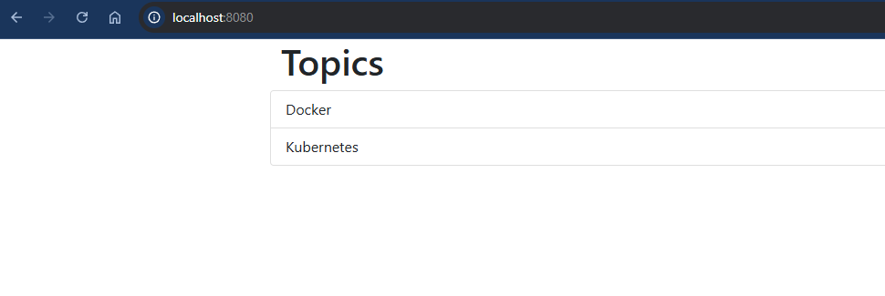

# Ejercicio 1 - Dockerizar Aplicación Lemoncode (corregido)

## Objetivo

Desplegar la aplicación fullstack Node.js + Express + MongoDB + Frontend en contenedores Docker sin Docker Compose, cumpliendo los siguientes requisitos:

- El contenedor de frontend debe ser el único que exponga puertos al host.
- MongoDB debe persistir datos en un volumen local montado en `/data/db`.
- Los contenedores deben comunicarse entre sí usando una red Docker personalizada.
- El frontend accede a la API mediante la variable de entorno `API_URI`.

---

### Paso 1. Crear red Docker personalizada

```bash
docker network create lemoncode-challenge
```

### Paso 2. Lanzar contenedor de MongoDB con volumen y script de inicialización

```bash
docker run -d   --name some-mongo   --network lemoncode-challenge   -v mongo-volume:/data/db   -v ${PWD}/mongo-init:/docker-entrypoint-initdb.d   mongo:7
```

> Este comando crea automáticamente el volumen `mongo-volume` y ejecuta el script de inicialización `init.js` para poblar la base de datos al arrancar.

### Paso 3. Lanzar backend con variable `DATABASE_URL`

```bash
docker run -d   --name topics-api   --network lemoncode-challenge   -e DATABASE_URL=mongodb://some-mongo:27017   backend-lemoncode
```

## Paso 4. Poblar la base de datos MongoDB a través de la API

En lugar de insertar directamente los documentos en MongoDB mediante `mongosh`, se han insertado mediante la API del backend usando `curl`:

```bash
docker run --rm --network lemoncode-challenge curlimages/curl \
  -X POST http://topics-api:5000/api/topics \
  -H "Content-Type: application/json" \
  -d '{"id":1,"name":"Docker"}'

docker run --rm --network lemoncode-challenge curlimages/curl \
  -X POST http://topics-api:5000/api/topics \
  -H "Content-Type: application/json" \
  -d '{"id":2,"name":"Kubernetes"}'
```

### Paso 5. Lanzar el contenedor del frontend

```bash
docker run -d   --name frontend-app   --network lemoncode-challenge   -p 8080:3000   -e API_URI=http://topics-api:5000/api/topics   frontend-lemoncode
```

### Paso 6. Visualizar en navegador

Abrimos: [http://localhost:8080](http://localhost:8080)

#### Captura de pantalla

