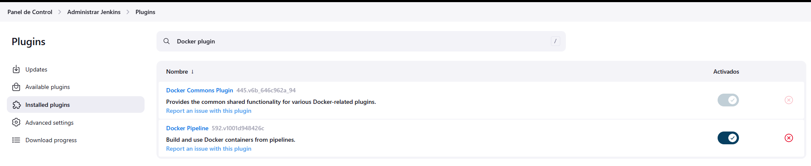
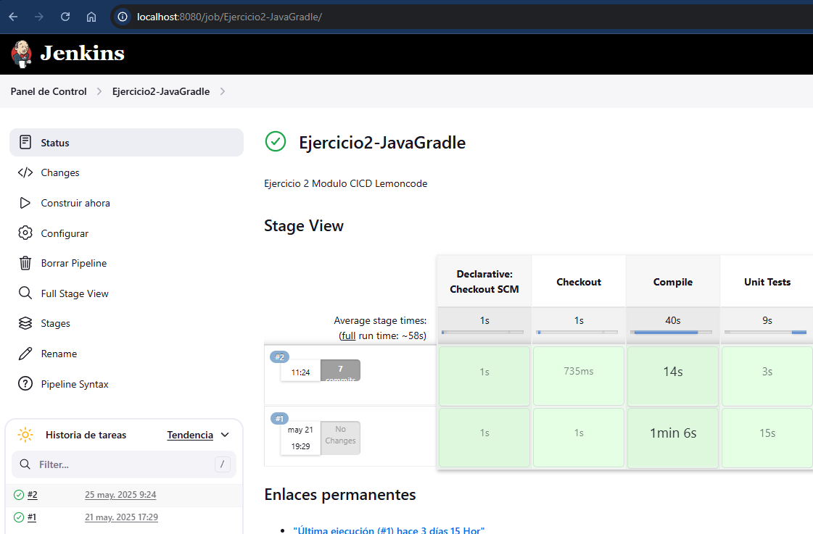

# Ejercicio 2 - Jenkins + Gradle con Docker

El objetivo es **modificar la pipeline del ejercicio 1** para que utilice una imagen Docker de Gradle (`gradle:6.6.1-jre14-openj9`) como agente de ejecución.
Configurando **Docker in Docker (DinD)** para levantar Jenkins usando los plugins adecuados.

## Objetivos

* Configurar Jenkins con Docker in Docker.
* Instalar y usar los plugins Docker y Docker Pipeline.
* Crear una pipeline declarativa que compile y ejecute tests de una app Java con Gradle.
* Usar la imagen oficial de Gradle como agente Docker.
* Ejecutar la pipeline sobre código fuente versionado en GitHub.

## 🛠️ Preparación del entorno

### Paso 1. Ejecutar Jenkins con Docker in Docker (DinD)

docker run -d --name jenkins-dind \
  --privileged \
  -u root \
  -p 8080:8080 -p 50000:50000 \
  -v /var/run/docker.sock:/var/run/docker.sock \
  -v jenkins_home:/var/jenkins_home \
  jenkins/jenkins:lts-jdk11

Se ha usado `--privileged` para otorgarle permisos especiales al contenedor para permitir que el Jenkins que corre dentro pueda ejecutar comandos de Docker en mi host anfitrión.
`-v /var/run/docker.sock:/var/run/docker.sock` para montar el socket de Docker en el contenedor de forma que Jenkins pueda ejecutar comoandos docker dentro del propio contenedor.
`-v jenkins_home:/var/jenkins_home` volumen para almacenar la configuración de Jenkins.

### Paso 2. Acceder a Jenkins

Desde el navegador, utilizamos el mismo usuario y contraseña que en el ejercicio 1 al usar el mismo volumen.

<http://localhost:8080>

### Paso 3. Instalar plugins Docker

Plugins instalados en Jenkins. Desde Manage Jenkins → Plugin Manager, se han instalado los siguientes plugins:

#### Jenkinsfile usado

El `Jenkinsfile` se ubicó en:

> Modulo4_CICD/Ejercicio2/Jenkinsfile

Este Jenkinsfile se ha subido al repositorio junto con el código fuente, en la rama main.

### Paso 4. Creación de la tarea en Jenkins

En Jenkins, se ha creado un job tipo Pipeline llamado Ejercicio2-JavaGradle.

Se ha seleccionado la opción Pipeline script from SCM.

Se ha configurado el repositorio Git y la rama main.

El campo Script Path apunta al archivo Jenkinsfile.

## Resultado esperado

Al ejecutar la tarea en Jenkins:

La pipeline se ha ejecutado correctamente y ha mostrado por consola:

Al ejecutar la tarea en Jenkins:

* Se clona el repositorio correctamente.
* Se compila el código sin errores.
* Se ejecutan los tests unitarios.
* El resultado final es: `Finished: SUCCESS`

