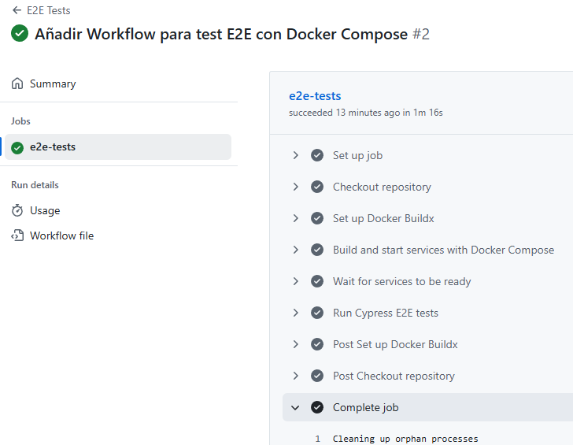
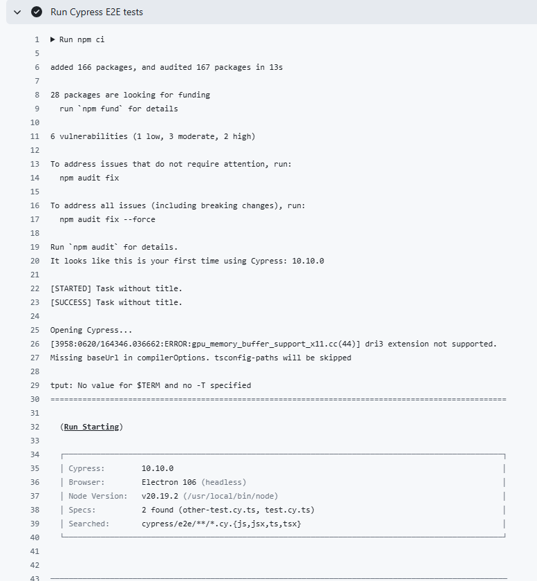
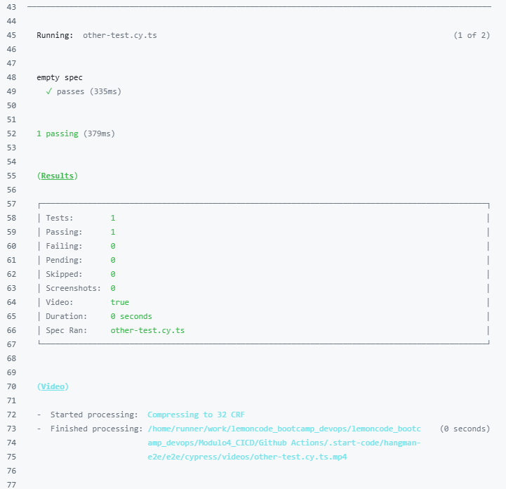
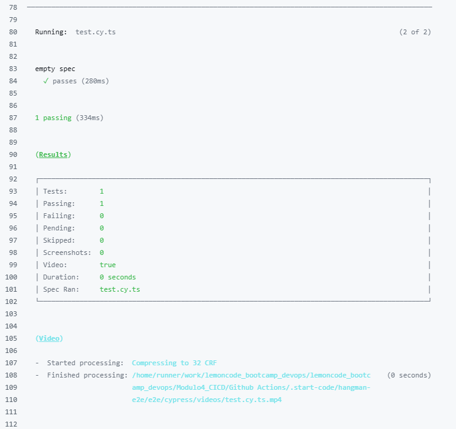
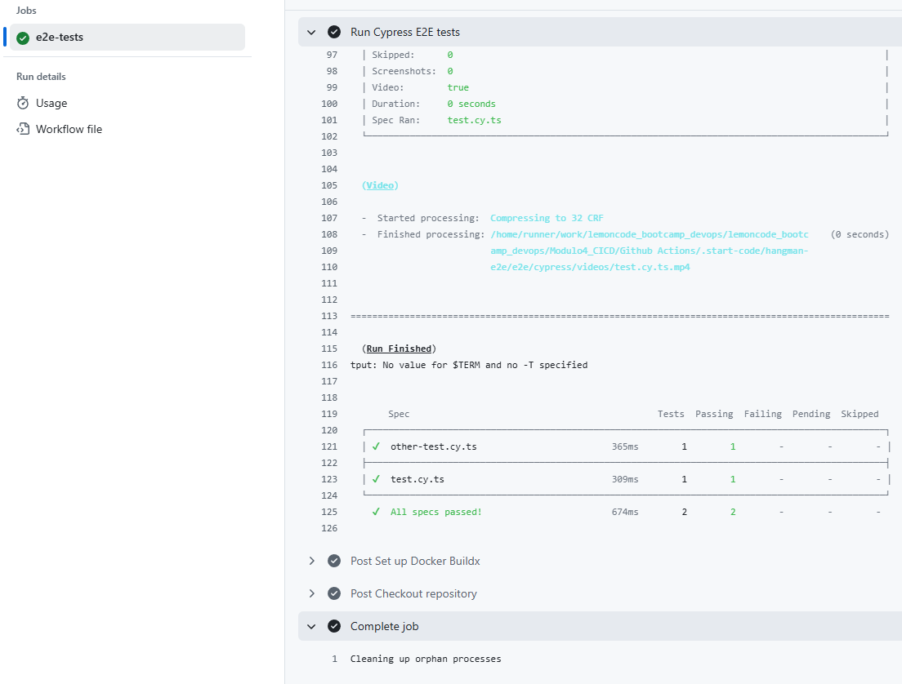

# Ejercicio 3 - Tests End-to-End con GitHub Actions y Docker Compose

## Objetivo

Crear un workflow en GitHub Actions que ejecute los tests end-to-end (E2E) del proyecto `hangman-e2e`, utilizando `Docker Compose` para levantar los servicios necesarios (API y frontend).

---

## Estructura del proyecto

La estructura del proyecto se organiza de la siguiente forma:

```sh
Modulo4_CICD/Github Actions/.start-code/
├── docker-compose.yml
├── hangman-api/
│   └── Dockerfile
├── hangman-front/
│   └── Dockerfile
└── hangman-e2e/
    └── e2e/
        └── package.json
```

El fichero del workflow se encuentra en la ruta estándar:

```sh
.github/workflows/e2e-tests.yml
```

---

## Descripción del workflow E2E

El workflow se denomina `E2E Tests` y contiene un único job:

* `e2e-tests`: levanta los servicios mediante `Docker Compose` y ejecuta los tests E2E con `Cypress`.

Se ejecuta automáticamente en cada push o pull request sobre la rama `main`, según la configuración:

```yaml
on:
  push:
    branches: [main]
  pull_request:
    branches: [main]
```

---

## Detalle de pasos del job

Los pasos que ejecuta el job `e2e-tests` son:

1. **Checkout del repositorio:** clona el código fuente del proyecto.
2. **Setup de Docker Buildx:** prepara el entorno para construir imágenes.
3. **Construcción y levantado de servicios:** ejecuta `docker compose up -d --build` desde el directorio `.start-code`, construyendo las imágenes de `hangman-api` y `hangman-front` desde sus respectivos `Dockerfile`.
4. **Espera activa:** espera unos segundos para asegurar que los servicios estén disponibles.
5. **Ejecución de tests E2E:** accede al directorio `hangman-e2e/e2e`, instala dependencias con `npm ci` y lanza los tests en modo headless con `npx cypress run`.

---

## Evidencia de ejecución correcta

A continuación se muestra la ejecución satisfactoria del workflow `e2e-tests.yml` en GitHub Actions:











---

## Resultado de los tests

Los tests se ejecutan correctamente accediendo a los servicios levantados por Docker Compose en el entorno de GitHub Actions:

* `hangman-api` disponible en `http://localhost:3001`
* `hangman-front` disponible en `http://localhost:8080`

La batería de pruebas E2E definida con `Cypress` verifica el funcionamiento conjunto del frontend y la API.
