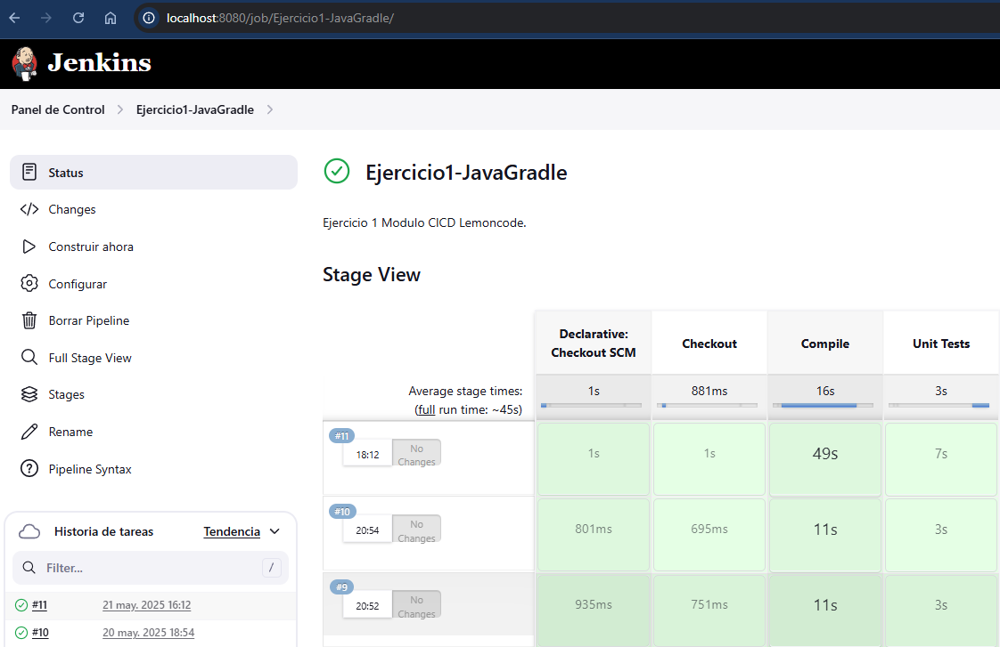

# Ejercicio 1 - Jenkins CI/CD con Java + Gradle

## Objetivo del ejercicio

> Crear un `Jenkinsfile` en el directorio raíz del proyecto que contenga una pipeline declarativa con los siguientes stages:
>
> 1. **Checkout**: descarga del código desde un repositorio GitHub.
> 2. **Compile**: compilar el código fuente utilizando `./gradlew compileJava`.
> 3. **Unit Tests**: ejecutar los tests unitarios con `./gradlew test`.

## Preparación del entorno

### Paso 1. Construcción de la imagen Docker personalizada

Se parte de un Dockerfile proporcionado:

```bash
docker build -t jenkins-gradle -f gradle.Dockerfile .
```

Esto genera una imagen basada en `jenkins:lts-jdk11` con Gradle 6.6.1 instalado.

### Paso 2. Arrancar el contenedor de Jenkins

```bash
docker run -d \
  --name jenkins-gradle-container \
  -p 8080:8080 -p 50000:50000 \
  -v jenkins_home:/var/jenkins_home \
  jenkins-gradle
```

### Paso 3. Obtener la contraseña inicial

Para desbloquear Jenkins en su primer acceso:

```bash
docker exec jenkins-gradle-container cat /var/jenkins_home/secrets/initialAdminPassword
```

### Paso 4. Acceder a Jenkins

Desde el navegador:

<http://localhost:8080>

## Preparación del repositorio

### Paso 5. Subida del código fuente a GitHub

El código fuente está en la carpeta:

> Modulo4_CICD/Jenkins/jenkins-resources

Y se sube al repositorio GitHub:

```bash
git add "Modulo4_CICD/Jenkins/jenkins-resources"
git commit -m "Añadir código fuente del ejercicio Jenkins a Modulo 4 - CICD"
git push
```

### Paso 6. Asegurar permisos de ejecución del wrapper Gradle

Esto es necesario para que `./gradlew` funcione dentro del contenedor de Jenkins (Linux):

```bash
git update-index --chmod=+x Modulo4_CICD/Jenkins/jenkins-resources/calculator/gradlew
```

Y hacer commit y push:

```bash
git commit -m "Dar permisos de ejecución a gradlew"
git push
```

## Jenkinsfile usado

El `Jenkinsfile` se ubicó en:

> Modulo4_CICD/Jenkins/Ejercicio1/Jenkinsfile

### Paso 7. Creación de la tarea en Jenkins

En Jenkins, se ha creado un job tipo Pipeline llamado Ejercicio1-JavaGradle.

Se ha seleccionado la opción Pipeline script from SCM.

Se ha configurado el repositorio Git y la rama main.

El campo Script Path apunta al archivo Jenkinsfile.

## Resultado esperado

Al ejecutar la tarea en Jenkins:

* Se clona el repositorio correctamente.
* Se compila el código sin errores.
* Se ejecutan los tests unitarios.
* El resultado final es: `Finished: SUCCESS`


