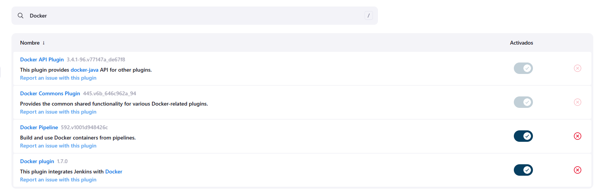

# Ejercicio 2 - Jenkins + Gradle con Docker

El objetivo es **modificar la pipeline del ejercicio 1** para que utilice una imagen Docker de Gradle (`gradle:6.6.1-jre14-openj9`) como agente de ejecución. Configurando **Docker in Docker (DinD)** para levantar Jenkins usando los plugins adecuados.

---

## Objetivos

* Configurar Jenkins con Docker in Docker.
* Instalar y usar los plugins Docker y Docker Pipeline.
* Crear una pipeline declarativa que compile y ejecute tests de una app Java con Gradle.
* Usar la imagen oficial de Gradle como agente Docker.
* Ejecutar la pipeline sobre código fuente versionado en GitHub.

---

## 🛠️ Preparación del entorno

### Paso 1. Ejecutar Jenkins con Docker in Docker (DinD)

```bash
docker run -d --name jenkins-dind \
  --privileged \
  -u root \
  -p 8080:8080 -p 50000:50000 \
  -v /var/run/docker.sock:/var/run/docker.sock \
  -v jenkins_home:/var/jenkins_home \
  jenkins/jenkins:lts-jdk11
```

> Se ha usado `--privileged` para otorgar permisos extendidos al contenedor.
>
> `-v /var/run/docker.sock:/var/run/docker.sock` permite que Jenkins acceda al Docker del host.
>
> `-v jenkins_home:/var/jenkins_home` mantiene persistente la configuración de Jenkins.

### Paso 2. Instalar Docker CLI dentro del contenedor Jenkins (solo necesario si no se crea una imagen personalizada)

Aunque se monte el socket Docker del host, la imagen oficial `jenkins/jenkins:lts-jdk11` **no incluye el binario `docker`**, por lo tanto fue necesario instalarlo manualmente:

```bash
docker exec -it jenkins-dind bash
apt update
apt install -y docker.io
```

Alternativamente, se podría haber creado una imagen personalizada modificando el `gradlew.Dockerfile` o automatizado mediante un script que prepare el entorno.
Este paso fue fundamental para que Jenkins pudiera ejecutar pipelines que usan `agent { docker { ... } }`.

---

### Paso 3. Acceder a Jenkins

Desde el navegador, accedemos a:

[http://localhost:8080](http://localhost:8080)

Se ha usado el mismo usuario y contraseña del Ejercicio 1 al mantener el mismo volumen `jenkins_home`.

---

### Paso 4. Instalar plugins Docker

Plugins instalados en Jenkins desde **Manage Jenkins → Plugin Manager**:

* Docker
* Docker Pipeline



---

### Jenkinsfile usado

El `Jenkinsfile` se ubicó en:

📄 `Modulo4_CICD/Jenkins/Ejercicio2/Jenkinsfile`

Este Jenkinsfile hace uso del agente Docker con la imagen `gradle:6.6.1-jre14-openj9`, y los comandos se ejecutan dentro del directorio:

📁 `Modulo4_CICD/Jenkins/jenkins-resources/calculator`

El fichero `gradlew` se aseguró que tuviera permisos de ejecución mediante:

```bash
git update-index --chmod=+x Modulo4_CICD/Jenkins/jenkins-resources/calculator/gradlew
```

---

### Paso 5. Creación de la tarea en Jenkins

1. En Jenkins, se ha creado un job tipo **Pipeline** llamado `Ejercicio2-JavaGradle`.
2. Se ha seleccionado la opción **Pipeline script from SCM**.
3. Se ha configurado:

   * Repositorio Git: `https://github.com/molmo073/lemoncode_bootcamp_devops.git`
   * Rama: `main`
   * Script Path: `Modulo4_CICD/Jenkins/Ejercicio2/Jenkinsfile`

---

## ✅ Resultado esperado

Al ejecutar la tarea en Jenkins:

* Se clona el repositorio correctamente.
* Se compila el código sin errores (`./gradlew compileJava`).
* Se ejecutan los tests unitarios (`./gradlew test`).
* El resultado final es: `Finished: SUCCESS`


